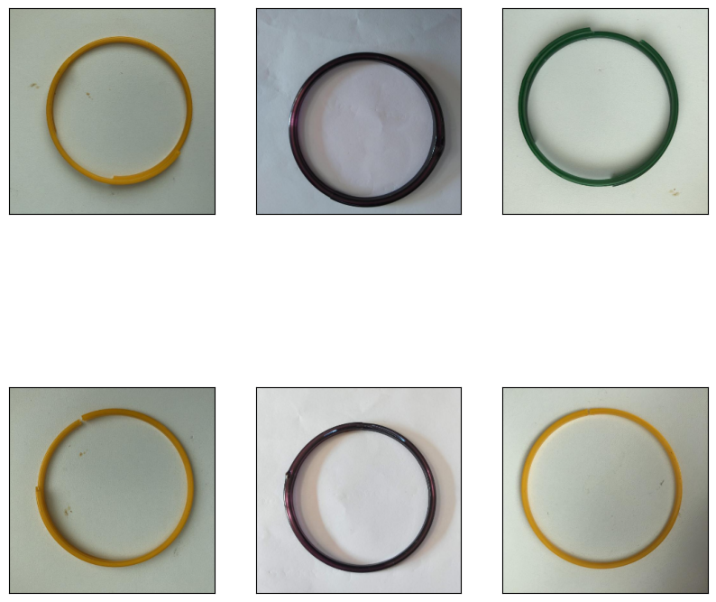

# BangleDefect
Using machine learning detect "Defect in Bangle Production"

In main.py change the Image path to get the Bangle Result image with defected part annotations
`makePred(ImagePath)`  This Funcion will save the new result image named as ResultImage.jpg

     

